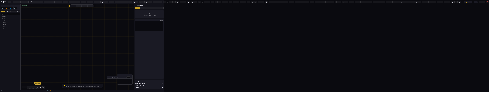
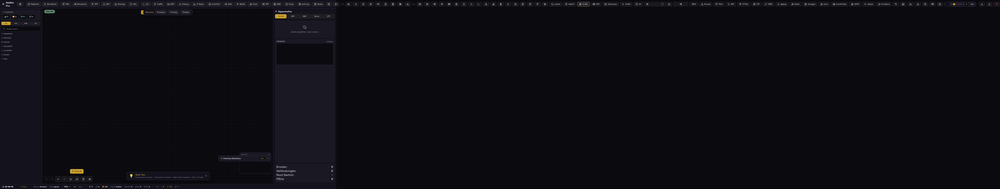
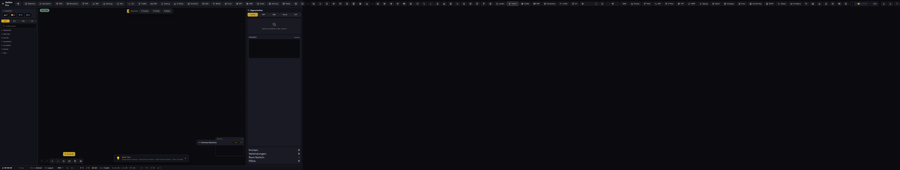

# Netzwerk-Simulator Pro

> Browserbasierter Netzwerk-Simulator - Cisco Packet Tracer Alternative


## 📸 Screenshots

### Hauptinterface


### VLAN Konfiguration


### Health Dashboard


### Network Summary


### Security Audit


### Syslog Viewer


## 🚀 Schnellstart

```bash
# Mit Browser öffnen
firefox /home/steimer/workspace/quizzes/network-sim/index.html

# Oder lokalen Server starten
cd /home/steimer/workspace/quizzes/network-sim
python3 -m http.server 8080
# Öffne: http://localhost:8080

# Mit Playwright testen
cd /home/steimer/workspace/quizzes/network-sim
npx playwright test
```

## ✨ Features

### Geräte (40+ Typen)
- 🖥️ PCs, Laptops, Server
- 🌐 Router (ISR, 1841, 1941, 2901)
- 🔌 Switches (2960, 3560, 3650)
- 📱 IoT-Geräte (Smart TV, Smart Light, Thermostat)
- 📡 Wireless APs

### Netzwerk-Funktionen
- 📡 **VLAN** - Virtuelle LANs mit VTP
- 🌳 **STP** - Spanning Tree Protocol
- 🛤️ **Routing** - RIP, OSPF, EIGRP
- 🔒 **NAT & ACL** - Network Address Translation
- 📊 **DHCP** - Pool Konfiguration
- 🔄 **CDP/LLDP** - Nachbarerkennung

### Simulation & Analyse
- 📦 **PDU Simulation** - ICMP, ARP, DHCP, DNS, TCP
- 🎯 **Packet Capture** - Wireshark-Style
- 📈 **Bandwidth Monitor** - Echtzeit-Statistiken
- 🔍 **Security Audit** - Sicherheits-Score
- 📋 **Syslog Viewer** - Systemprotokolle
- 🧪 **Network Testing** - Connectivity Tests

### Werkzeuge
- 💻 **CLI Terminal** - Tab-Completion, History
- 🧮 **Subnet Calculator** - IP-Berechnungen
- 📝 **Documentation** - Markdown Export
- 💾 **Auto-Save** - Version History
- ⭐ **Favorites** - Template Speicherung

## 🎮 Bedienung

### Topologie erstellen
1. **Gerät ziehen** - Von linker Leiste auf Canvas
2. **Verbinden** - Port anklicken und zu anderem Gerät ziehen
3. **Konfigurieren** - IP, VLAN, Services
4. **Simulieren** - PDU senden

### Tastaturkürzel
- `Del` - Auswahl löschen
- `Ctrl+Z` - Rückgängig
- `Ctrl+Y` - Wiederholen
- `Ctrl+A` - Alles auswählen
- `Ctrl+S` - Speichern

## 📁 Projektstruktur

```
network-sim/
├── index.html          # Hauptanwendung (~13000 Zeilen)
├── DOCUMENTATION.md    # Vollständige Dokumentation
├── PROJEKT.md          # Projektmanagement
├── TODO.md             # Aufgabenliste
└── screenshots/       # Screenshots
```

## 🧪 Tests

```bash
cd /home/steimer/workspace/quizzes/network-sim
npx playwright test
```

**Alle Tests: 6/6 ✓**

## 📊 Statistiken

| Metrik | Wert |
|--------|------|
| Codezeilen | ~13000 |
| Commits | 195 |
| Toolbar Buttons | 104+ |
| Gerätetypen | 40+ |
| Kabeltypen | 6 |
| Netzwerk-Templates | 14 |

## 🔗 Links

- [GitHub Repository](https://github.com/steimbyte/berichtsheft-generator/tree/feature/packet-tracer-parity/quizzes/network-sim)
- [Dokumentation](./DOCUMENTATION.md)
- [Changelog](./PROJEKT.md)

## 📝 Lizenz

MIT License
